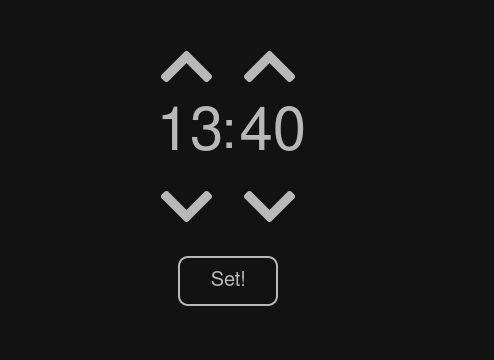

# Server-side code

This server is used as a front-end for controlling the alarm-clock over MQTT. The user selects a desired time for the alarm clock to go off which is then sent to the server. The server then publishes the time to the MQTT broker on the correct topic. The alarm clock reads the time and saves it into memory.

  

### Running the server

First, install all the dependencies - flask and paho-mqtt. You may use the command`pip install -r requirements.txt`. Then use `python sunrise_server.py` to run the server. However, that's suitable only for development purposes. If you intend to deploy it, I recommend using gunicorn and systemd services. You can find more about the topic in Flask documentation.

Note: The front-end uses jquery and FontAwesome.

